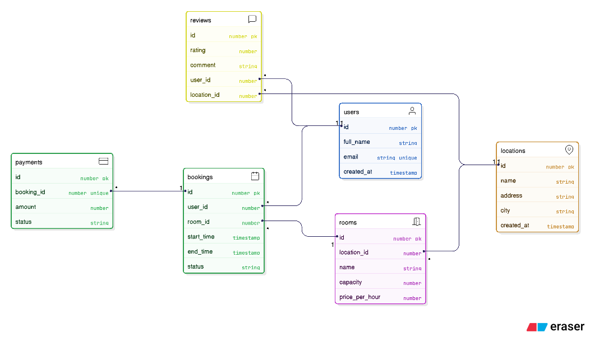

# Coworking Booking API - Plan

## 1. Business Idea
A coworking booking platform where users can find locations, choose rooms, make bookings, pay for bookings, and leave reviews.

## 2. Entities (Objects)
1. User
2. Location
3. Room
4. Booking
5. Payment
6. Review

## 3. Functional Requirements (User Stories)

### User
- User - Create - Profile  
  As a User, I can create a profile with full name and email.
- User - Read - Profile  
  As a User, I can view my profile details.
- User - Update - Profile  
  As a User, I can update my profile information.
- User - Delete - Profile  
  As a User, I can delete my profile.
- User - List - Users  
  As a User, I can view a list of users.

### Location
- Location - Create - Location  
  As a User, I can create a coworking location with name, address, and city.
- Location - Read - Location  
  As a User, I can view a location by ID.
- Location - Update - Location  
  As a User, I can update location details.
- Location - Delete - Location  
  As a User, I can delete a location.
- Location - List - Locations  
  As a User, I can view all locations and filter by city.

### Room
- Room - Create - Room  
  As a User, I can create a room in a location with capacity and price per hour.
- Room - Read - Room  
  As a User, I can view a room by ID.
- Room - Update - Room  
  As a User, I can update room details.
- Room - Delete - Room  
  As a User, I can delete a room.
- Room - List - Rooms  
  As a User, I can list rooms and filter by location.

### Booking
- Booking - Create - Booking  
  As a User, I can create a booking for a room with start/end time.
- Booking - Read - Booking  
  As a User, I can view booking details.
- Booking - Update - Booking  
  As a User, I can update booking time/status.
- Booking - Delete - Booking  
  As a User, I can cancel (delete) a booking.
- Booking - List - Bookings  
  As a User, I can list bookings and filter by user, room, and date range.

### Payment
- Payment - Create - Payment  
  As a User, I can create a payment for a booking.
- Payment - Read - Payment  
  As a User, I can view payment details.
- Payment - Update - Payment  
  As a User, I can update payment status.
- Payment - Delete - Payment  
  As a User, I can delete a payment.
- Payment - List - Payments  
  As a User, I can list payments and filter by booking.

### Review
- Review - Create - Review  
  As a User, I can create a review for a location with rating and comment.
- Review - Read - Review  
  As a User, I can view a review by ID.
- Review - Update - Review  
  As a User, I can update review rating/comment.
- Review - Delete - Review  
  As a User, I can delete a review.
- Review - List - Reviews  
  As a User, I can list reviews and filter by location or user.

## 4. ERD

ERD source files:
- `erd.txt`
